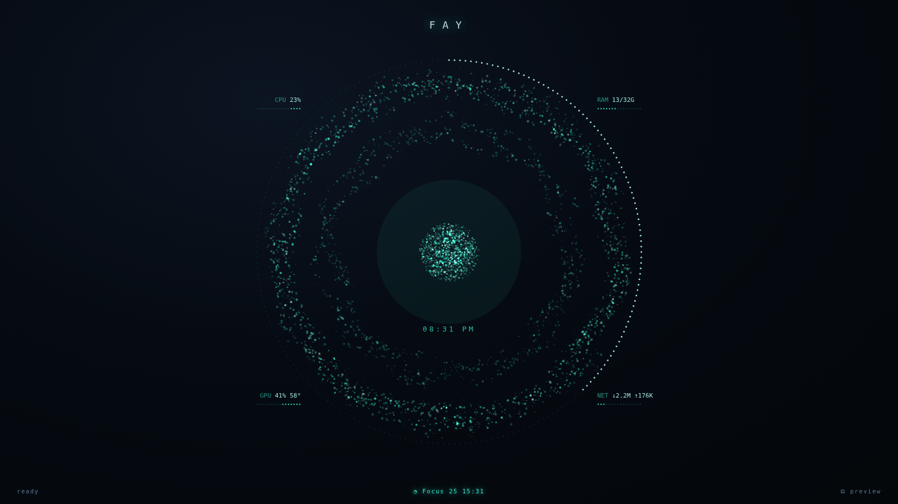

<p align="center">
  
</p>

# Fay

**A living command deck for your Windows desktop.**

Press a hotkey and a translucent particle *Heart* blooms over your wallpaper,
tinted to your Windows accent. Click it — or just start typing — to launch apps,
or fire a whole multi-window **scene** across both monitors. Tauri-based, a few
megabytes, and completely idle while hidden.

## Install (30 seconds, no toolchain)

1. Download the latest `Fay_…_x64-setup.exe` from **[Releases](https://github.com/Ariestotele/Fay/releases)**.
2. Run it. Fay starts quietly in the tray.
   *(SmartScreen may warn — it's unsigned. "More info → Run anyway".)*
3. Press **Ctrl+Alt+Space**.

Every push to `main` also produces a fresh installer under
*Actions → latest CI run → Artifacts → `Fay-windows-installer`*.

## What it does

| | |
| :-- | :-- |
| **The Heart** | Full-monitor translucent overlay with a canvas particle field: layered multi-speed rings and a pulsing particle sphere. The sphere is the button. Renders only while summoned. |
| **Scenes** | One tile launches a whole window layout across both screens (via a [PowerToys Workspaces](https://learn.microsoft.com/windows/powertoys/workspaces) shortcut), and can switch your audio output as it does. |
| **Direct hotkeys** | `Ctrl+Alt+1/2/3` fire scenes without even opening Fay. Any tile can have one. |
| **Keyboard-fast** | Deck open: `1–9` fires a tile, typing filters, `Enter` fires the first match, `Esc` backs out. |
| **Quicklinks** | `yt lofi` ⏎ opens a YouTube search. Any URL with `{query}` becomes one. |
| **Calculator** | `= 1440*0.62` → `892.8`, `= 5 mi to km` → `8.04672 km`. Enter copies the answer. |
| **System & media tiles** | Lock, Sleep, Shut down (press twice), Play/Pause, Volume ± — ready-made packs, or your own. |
| **Snippets** | A tile that pastes a saved text into whatever app is in front. |
| **Folders** | A tile with `children` opens a sub-deck. Nine keys, unlimited tiles. |
| **Multi-action** | `actions: [ … ]` runs steps in order with pauses — Stream Deck style. |
| **Scene teardown** | `closes: ["Discord", "zen"]` — Shift+click a scene to close what it opened. |
| **Commands folder** | Drop `.ps1` / `.bat` / `.exe` / `.lnk` files in a folder; they become tiles. |
| **Live stats** | CPU · RAM · GPU · NET readouts orbit the Heart at rest, with dotted gauges. |
| **Focus timer** | A pomodoro tile; the Heart's outer arc fills as time passes, a toast fires when it's up. |
| **Real icons** | Each tile shows its app's actual icon, extracted and cached automatically. |
| **Running dot** | Apps already open get a glowing dot, so a scene doesn't relaunch them by surprise. |
| **Accent auto** | Colors follow your Windows accent color (or pin a hex). |
| **Discord-safe audio** | Scenes switch the *Console/Multimedia* default device only — Discord stays where it is. |
| **Yours, per machine** | One config, with per-PC path overrides keyed by computer name. |
| **Editable after install** | Config lives in `%APPDATA%`; tray › *Open config file* / *Reload config*. No rebuild. |

## Configure

Tray › **Open config file** opens `%APPDATA%\com.fay.hub\apps.config.json` in
Notepad. Save, then tray › **Reload config**.

```json
{
  "app": {
    "hotkey": "Ctrl+Alt+Space", "mouseSummon": "Ctrl+Mouse5", "accent": "auto", "backdrop": 0.62,
    "startHidden": true, "autostart": false
  },
  "scenes": [
    { "id": "game", "name": "Game", "glyph": "◈", "hotkey": "Ctrl+Alt+2",
      "target": "%USERPROFILE%\\Desktop\\Fay-Game.lnk",
      "audioOut": "Hyper X Cloud 3 Wireless (HyperX Cloud III Wireless)" }
  ],
  "apps": [
    { "id": "zen",   "name": "Zen",   "glyph": "◯", "target": "%LOCALAPPDATA%\\Programs\\zen\\zen.exe" },
    { "id": "steam", "name": "Steam", "glyph": "▸", "target": "steam://open/main" },
    { "id": "yt",    "name": "YouTube", "keyword": "yt", "target": "https://www.youtube.com/results?search_query={query}" },
    { "id": "sig",   "name": "Sign-off", "kind": "snippet", "text": "Best regards,\nMe" }
  ],
  "packs": ["power", "media"],
  "machines": {
    "DESKTOP-GAMING": { "tiles": { "zen": { "target": "D:\\Apps\\Zen\\zen.exe" } } }
  }
}
```

### Reference

| Key | On | Meaning |
| :-- | :-- | :-- |
| `hotkey` | `app` | Summon combo. Keyboard only (`Ctrl`, `Alt`, `Shift`, `Super`, `CmdOrCtrl` + key). |
| `mouseSummon` | `app` | Mouse-button summon, e.g. `"Ctrl+Mouse5"` (`Mouse4`/`Mouse5` + `Ctrl`/`Alt`/`Shift`). `""` = off. |
| `accent` | `app` | `"auto"` = follow Windows accent, or a `#rrggbb`. |
| `backdrop` | `app` | 0–1, how much the wallpaper is dimmed behind the Heart. |
| `startHidden` | `app` | Start in the tray (default `true`). |
| `autostart` | `app` | Launch Fay at login. |
| `summonOn` | `app` | `"cursor"` (default) opens Fay on the monitor under the mouse; `"current"` keeps the last one. |
| `stats` / `statsInterval` | `app` | Live readouts around the Heart (default on, every 2500 ms). |
| `minutes` | tile | With `"kind": "focus"`: start a focus timer of that length (`"action": "stop"` for a stop tile). |
| `packs` | root | Preset tile sets: `power`, `media`, `tools`, `settings`, `links`. See [docs/SETUP.md](docs/SETUP.md). |
| `system` | root | A third tile group, next to `scenes` and `apps`. |
| `kind` | tile | `launch` (default), `system`, `media` or `snippet`. |
| `action` | tile | `system`: `lock sleep hibernate restart shutdown logoff recycle darkmode`. `media`: `playpause next prev stop mute volup voldown`. |
| `text` / `paste` | tile | Snippet text; `"paste": false` copies without pasting. |
| `keyword` | tile | Quicklink keyword for a `target` containing `{query}` (defaults to `id`). |
| `children` | tile | Makes the tile a folder holding these tiles. |
| `actions` | tile | Multi-action: steps run in order; `{ "wait": 400 }` pauses. |
| `closes` / `closeHotkey` | tile | Process names to close on Shift+click / ×; `"name!"` forces. Optional global hotkey for it. |
| `commands` | root | `true` (default folder), `false`, or a folder path of scripts that become tiles. |
| `confirm` | tile | Require a second press within 3 s (default on for shutdown / restart / logoff / hibernate). |
| `target` | tile | An exe path, a command on PATH, a `.lnk`, or a URL / protocol (`steam://`, `ms-phone:`). `%ENV%` vars expand. |
| `hotkey` | tile | Fire this tile globally, without opening Fay. |
| `audioOut` | tile | Switch the default playback device first (needs [SoundVolumeView](https://www.nirsoft.net/utils/sound_volume_view.html) on PATH). |
| `elevated` | tile | Run as administrator (UAC prompt). |
| `process` | tile | Override the process name used for the running dot. |
| `icon` | tile | Override the extracted icon with a URL / data URL. |
| `hint` | tile | Small caption under the name. |
| `machines` | root | `{"<COMPUTERNAME>": {"tiles": {"<id>": {…overrides}}}}`. |

## Scenes in three steps

1. Open the PowerToys **Workspaces** editor, arrange your windows across your monitors, save.
2. **Create desktop shortcut** for it.
3. Point a scene's `target` at that `.lnk`. Done — click the tile or press its hotkey.

Full setup, caveats and troubleshooting: **[docs/SETUP.md](docs/SETUP.md)**.

## Develop

```
git clone https://github.com/Ariestotele/Fay.git && cd Fay
npm install
npm run dev
```

Needs Node.js and Rust. CI compiles the app on Windows and builds an installer
on every push; a new `version` on `main` publishes a Release automatically.

The project's working memory is in `docs/`: **STATE.md** (what's done / next),
**ARCHITECTURE.md** (how it's built), **DECISIONS.md** (why, append-only).

## Status

Nineteen phases shipped and CI-green. See [docs/STATE.md](docs/STATE.md).
